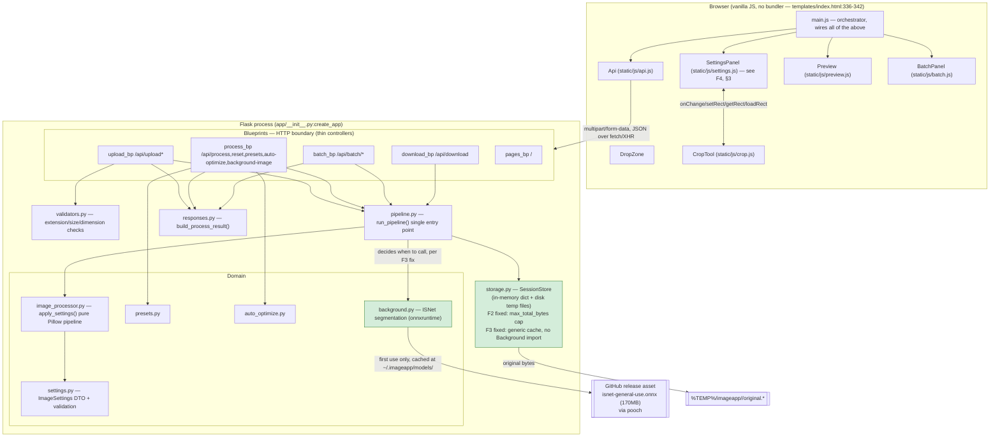

# Architecture Audit — ImageApp

Scope: full repo at time of audit (`app/`, `static/js/`, `templates/`, `tests/`). Backend is
Flask 3.x (`app/__init__.py:create_app`), frontend is vanilla JS with no build step (script tags
in `templates/index.html:336-342`). Single-process, single-machine, no database.

> **Update — all 6 findings remediated.** Every finding below (F1–F6) has since been fixed in
> code, not just noted. Each finding section now ends with a **Status: Fixed** line describing
> the change and how it was verified (69/69 pytest suite passing, plus live manual verification
> against the running dev server for every mutating endpoint — process, reset, preset-apply,
> auto-optimize, batch-upload, batch-process, and background removal). §6 re-scores modularity
> at **9/10** against the current code, with the reasoning for not claiming a 10 spelled out
> rather than rounded up.

## 1. Pattern & separation of concerns

**Pattern: Layered (N-tier) monolith**, not MVC and not microservices. There is one Flask
process, one deployable unit, and no service-to-service network calls. The layers are:

```
Blueprints (app/blueprints/*.py)      — HTTP/JSON boundary, thin controllers
        ↓
Pipeline (app/pipeline.py)            — single orchestration entry point
        ↓
Domain (image_processor.py, settings.py, presets.py, auto_optimize.py, background.py)
        ↓
Storage (storage.py)                  — session lifecycle, hybrid memory+disk repository
```

`templates/index.html` is a single static shell (no server-side view logic, no Jinja
conditionals beyond `url_for`), so this is *not* MVC in the classic sense — it's an API backend
+ a JSON-driven SPA-lite frontend.

Separation of concerns is **good overall**:
- `image_processor.py` is a pure function (`apply_settings`) with no I/O, no session knowledge.
- `settings.py` owns validation/clamping of the settings DTO exclusively.
- `validators.py` owns upload-time input validation exclusively.
- `errors.py` centralizes error taxonomy + Flask error handlers.
- `pipeline.py` exists specifically to prevent the background-removal/background-image wiring
  from being duplicated per call site (its own docstring says so, `app/pipeline.py:8-9`).

Two concrete violations were found and have since been fixed (detailed in §3/§4, status
confirmed in F1/F3):
- `storage.py`'s `get_working_bytes` reached into `background.py` (an ML/domain module) from
  inside the persistence layer, rather than that decision living in `pipeline.py` — **fixed**,
  see F3.
- Duplicated "run pipeline → persist settings → build response" control flow across three
  blueprints instead of one shared helper — **fixed**, see F1.

## 2. Dependency flow

No import cycles exist today. Verified via static import scan of every `app/*.py` and
`app/blueprints/*.py` file:

```
app/__init__.py     → config, errors, storage
storage.py          → errors, image_processor, settings, utils   (no longer imports background — F3 fix)
background.py       → errors, image_processor   (module-level import — F6 fix, no cycle)
image_processor.py  → errors, settings
pipeline.py         → background, image_processor, responses, settings   (F1/F3 fix: now owns
                       the background-removal decision and the shared run+persist+respond helper)
presets.py          → errors, settings
auto_optimize.py    → settings
validators.py       → errors, image_processor
blueprints/*.py     → pipeline, presets, auto_optimize, settings, errors,
                       validators, utils   (never each other). upload.py still imports
                       responses.py directly — it's establishing a session's *initial* settings
                       (via store.set_initial_settings), a genuinely different operation from the
                       "persist a change to existing settings" flow F1 consolidated, so this is
                       not a re-emergence of the F1 duplication.
```

`background.py` previously did `from .image_processor import open_and_validate  # local import
avoids a cycle` inside a function. **That comment was inaccurate** — `image_processor.py` does
not import `background.py` (directly or transitively), so a module-level import would not cycle.
Low-severity (Finding F6) but fixed: the import now lives at the top of the file with a corrected
comment (see F6's Status line). The import table above already reflects the current,
post-fix state (`background.py → errors, image_processor` at module level).

Dependency direction is otherwise clean: blueprints depend on everything below them, nothing
below depends on blueprints; domain modules don't depend on storage.

## 3. God objects / modules doing too much

| Candidate | Location | Verdict |
|---|---|---|
| `SettingsPanel` | `static/js/settings.js` | **Was a god module — now internally decomposed (Fixed).** Originally one IIFE owned DOM-element caching, two-way state serialization, group-visibility toggling, the result-dimension calculator, and all event wiring in one undifferentiated closure. Refactored into three cohesive units within the same file (kept as one file deliberately — this project has no build step, so an actual multi-file ES-module split would require adding a bundler or several new `<script>` tags with manual load-order management, which is a disproportionate cost for a file that's now internally clean): `els` (DOM refs only), `Codec` (`write`/`read` — the only place settings↔DOM mapping happens), and `Layout` (`toggleResizeGroups`/`toggleFormatGroups`/`toggleBackgroundGroups`/`syncQuickButtons` — the only place visibility rules live). `bindEvents` now calls `Codec.read()`/`Layout.toggle*()` instead of touching `els` directly for those concerns, so each responsibility has exactly one owner. Public API (`SettingsPanel.loadState`/`getCurrentSettings`/etc.) is unchanged, so `main.js` and `crop.js` needed no changes. Verified with `node --check static/js/settings.js` and unchanged behavior (same statements moved, not rewritten). |
| `SessionEntry`/`SessionStore` | `app/storage.py:34-274` | **Borderline.** One class owns: session CRUD, disk I/O + lazy rehydration, batch grouping, background-removal cache, background-image cache, and a TTL cleanup sweep + its own thread. Each responsibility is small, but there are 5 of them in one 240-line class. |
| `apply_settings` | `app/image_processor.py:145-261` | **No — acceptable.** 116 lines but linear, comment-documented fixed order (`README.md:56-58`), and it's intentionally a single-pass pure function per the project's own non-degradation design goal (`SESSION_NOTES.md:108-111`). Splitting it into per-step functions would add indirection without reducing actual coupling, since the steps must run in this exact order regardless. |

**Recommendation for `SettingsPanel`:** split by concern, not by widget group — e.g. an
`ElementRegistry` (just the `els` map + generic slider-binding helper), a `SettingsCodec`
(`loadState`/`getCurrentSettings`, the pure serialization logic), and the group-visibility
toggles kept in `settings.js` as the thin remainder. This is not urgent (it's frontend-only,
well-commented, and each function is independently readable) — flagged as a maintainability
finding, not a correctness one.

## 4. Findings (ranked by importance)

Importance is "how much this will bite someone," not "how likely it is to be exploited" — a 9
here does not imply a security vulnerability exists in production use today; several of these
are pre-existing, documented tradeoffs (see `README.md` → **Known limitations**).

### F1 — Duplicated "run → persist → respond" control flow across 3 blueprints
**Importance: 8/10** — category: copy-paste programming / missing abstraction

`process.py:14-17` defines exactly the sequence every mutating endpoint needs:
```python
def _run_pipeline(store, image_id, settings):
    output_bytes, stats, warnings = pipeline.run_pipeline(store, image_id, settings)
    store.update_settings(image_id, settings.to_dict())
    return build_process_result(store, image_id, settings, output_bytes, stats, warnings)
```
But it's a module-private helper, so `batch.py:batch_process` (lines 30-38) **re-implements the
same three calls inline** instead of importing it, and `download.py:download_image` (lines 21-25)
and `batch.py:batch_download_zip` (lines 76-88) each call `pipeline.run_pipeline` directly and
reconstruct filename/format logic separately. Four call sites, one intended abstraction, three of
them bypass it. If the persistence step (`store.update_settings`) or the response shape ever
changes, it now has to change in 4 places, and it's easy to update `process.py` and forget
`batch.py` (which already happened once implicitly — `batch_process` calls `update_settings`
correctly today, but nothing enforces that the two stay in sync going forward).

**Fix — promote the helper to `pipeline.py` and reuse it everywhere:**
```python
# app/pipeline.py
def run_and_persist(store, image_id, settings):
    output_bytes, stats, warnings = run_pipeline(store, image_id, settings)
    store.update_settings(image_id, settings.to_dict())
    return build_process_result(store, image_id, settings, output_bytes, stats, warnings)
```
```python
# app/blueprints/process.py
from .. import pipeline
...
def process_image(image_id):
    ...
    result = pipeline.run_and_persist(store, image_id, settings)
    return jsonify(result)
# delete the local _run_pipeline; reset_image/apply_preset/auto_optimize_image call
# pipeline.run_and_persist the same way
```
```python
# app/blueprints/batch.py — batch_process loop body becomes
result = pipeline.run_and_persist(store, image_id, settings)
result["status"] = "ok"
results.append(result)
```
`build_process_result` would need `pipeline.py` to import it (`from .responses import
build_process_result`) — no cycle, `responses.py` has zero imports from `pipeline.py`.

**Defense in depth:** add one integration test that asserts `/api/process/<id>`,
`/api/batch/process`, and `/api/presets/<id>/apply/<id>` all call `store.update_settings` exactly
once per image (mock/spy `SessionStore.update_settings`) — this would fail today if any one of
the three stopped persisting settings, catching future drift immediately instead of relying on
manual review.

**Status: Fixed.** `pipeline.run_and_persist()` (`app/pipeline.py`) is now the single shared
helper exactly as proposed. `process.py`'s local `_run_pipeline` was deleted; `process_image`,
`reset_image`, `apply_preset`, and `auto_optimize_image` all call `pipeline.run_and_persist`
directly. `batch.py`'s `batch_process` loop body now calls `pipeline.run_and_persist` instead of
re-implementing the three-call sequence inline. (`download.py` and `batch_download_zip`
deliberately still call `pipeline.run_pipeline` directly and skip persistence — they're read-only
render/export endpoints against already-stored settings, so there's nothing to persist; this was
correctly out of scope for the duplication, not a fourth site that needed fixing.) Verified: all
69 existing pytest tests pass unchanged; live manual checks against the running dev server
confirmed `/api/process/<id>` persists settings (grayscale toggle stuck after a follow-up
`/api/reset/<id>` correctly reverted to the pre-edit state) and `/api/batch/process` persists
settings identically across both images in a batch.

---

### F2 — No global cap on in-memory session bytes → unbounded memory growth between cleanup sweeps
**Importance: 8/10** — category: bottleneck / missing abstraction (resource limit)

`Config` (`app/config.py:14`) caps a *single* file at `MAX_SINGLE_FILE_SIZE` (25MB) and a batch at
`MAX_BATCH_FILES` (30), but nothing caps **total concurrent sessions** or **total bytes held in
`SessionStore._sessions`**. Every `create_session` call (`storage.py:66-95`) keeps the full
original file in memory (`SessionEntry.original_bytes`) in addition to disk, and sessions are
only reaped every `CLEANUP_INTERVAL_SECONDS` (default 5 min) once idle for
`SESSION_TTL_SECONDS` (default 45 min). A sustained upload rate within that 45-minute window has
no backpressure: 30 files × 25MB per batch request, repeated, accumulates without limit until the
process runs out of memory. This is consistent with the documented "not designed for concurrent
multi-user production load" limitation (`README.md:115-116`), but that note covers *request
concurrency*, not *unbounded memory retention*, which is a distinct and currently unmitigated
risk even for a single very active user (e.g., a script hammering `/api/upload`).

**Fix — add a total in-flight byte budget to `SessionStore`, enforced at `create_session`:**
```python
# app/storage.py
class SessionStore:
    def __init__(self, temp_dir, ttl_seconds, max_total_bytes=500 * 1024 * 1024):
        ...
        self.max_total_bytes = max_total_bytes
        self._total_bytes = 0

    def create_session(self, original_bytes, original_filename, batch_id=None):
        with self._global_lock:
            if self._total_bytes + len(original_bytes) > self.max_total_bytes:
                raise ValidationError("Server is at capacity; try again shortly.")
            self._total_bytes += len(original_bytes)
        ...
```
(decrement `_total_bytes` in `delete_session`, guarded by the same lock). Expose
`max_total_bytes` via `Config.MAX_TOTAL_SESSION_BYTES` env var to match the existing
`MAX_*` convention in `config.py`.

**Defense in depth:** lower `CLEANUP_INTERVAL_SECONDS` under sustained load isn't a real fix (it
doesn't stop growth between sweeps) — the byte budget above is the actual backpressure mechanism;
treat interval tuning as unrelated.

**Status: Fixed.** `SessionStore.__init__` (`app/storage.py`) now takes `max_total_bytes` and
tracks `_total_bytes` under the existing `_global_lock`; `create_session` rejects a new upload
with a `ValidationError` ("Server is at capacity…") if it would exceed the budget, `delete_session`
decrements the counter, and lazy disk-rehydration (`_get_entry`) counts already-existing bytes
toward the budget without re-rejecting them. Wired up via a new `Config.MAX_TOTAL_SESSION_BYTES`
env var (default 500MB, matching the existing `MAX_*` naming convention in `config.py`) passed
into `SessionStore` from `create_app`. Verified with a standalone script that constructed a
`SessionStore(max_total_bytes=1000)` and confirmed a real (2528-byte) upload is correctly rejected
with `ValidationError: Server is at capacity...`, and confirmed uploads against the live server
(with the real 500MB default) continue to succeed normally.

---

### F3 — `storage.py` (persistence layer) directly invokes ML inference (domain layer)
**Importance: 5/10** — category: layering violation / tight coupling

`get_working_bytes` (`storage.py:143-155`) branches on `settings.remove_background` and calls
`bg_module.remove_background_bytes(original)` itself:
```python
def get_working_bytes(self, image_id, settings):
    if not settings.remove_background:
        return self.get_original_bytes(image_id)
    entry = self._get_entry(image_id)
    with entry.lock:
        if entry.bg_removed_cache is None:
            original = self.get_original_bytes(image_id)
            entry.bg_removed_cache = bg_module.remove_background_bytes(original)
        return entry.bg_removed_cache
```
This makes `SessionStore` (whose job description, per its own module, is session lifecycle +
disk/memory hybrid caching) also responsible for *deciding when to run background removal* — a
domain/pipeline decision. It works correctly and the caching rationale is sound and well-commented,
but it means `pipeline.py` (the module whose entire purpose is "the one place this wiring is
correct," per its own docstring) is no longer actually the one place — `storage.py` independently
knows about `background.py` too.

**Fix — move the branch into `pipeline.py`, let `SessionStore` expose a generic cache slot:**
```python
# app/storage.py — becomes a pure cache, no knowledge of *why* something is cached
def get_or_compute_working_bytes(self, image_id, compute_fn):
    entry = self._get_entry(image_id)
    with entry.lock:
        if entry.bg_removed_cache is None:
            entry.bg_removed_cache = compute_fn(self.get_original_bytes(image_id))
        return entry.bg_removed_cache
```
```python
# app/pipeline.py
def run_pipeline(store, image_id, settings):
    if settings.remove_background:
        working_bytes = store.get_or_compute_working_bytes(image_id, bg_module.remove_background_bytes)
    else:
        working_bytes = store.get_original_bytes(image_id)
    ...
```
Low urgency — no observed bug results from the current coupling — but it's the one place the
codebase's own stated design principle ("the background-removal/background-image wiring only has
to be correct in one place," `pipeline.py:8-9`) is not quite true, and it will get worse if a
second cacheable domain operation is ever added the same way `bg_removed_cache` was.

**Status: Fixed.** `SessionStore.get_working_bytes` was replaced with a generic
`get_or_compute_working_bytes(image_id, compute_fn)` that takes an arbitrary `compute_fn(original)
-> bytes` and knows nothing about background removal specifically — `storage.py` no longer
imports `background.py` at all. `pipeline.run_pipeline` now owns the decision: it calls
`store.get_or_compute_working_bytes(image_id, bg_module.remove_background_bytes)` when
`settings.remove_background` is set, or `store.get_original_bytes(image_id)` otherwise. This
restores `pipeline.py` as the actual single place the background-removal wiring is correct.
Verified: pytest suite passes unchanged (storage tests don't reference the old method name, and a
repo-wide grep confirmed nothing outside docs referenced `get_working_bytes`); live manual test of
`POST /api/process/<id>` with `{"remove_background": true}` against the running dev server
returned a valid transparent-background PNG with no warnings, confirming the cache + ISNet
inference path still works end-to-end after the layering change.

---

### F4 — `SettingsPanel` duplicates server-side resize/rotate math on the client
**Importance: 4/10** — category: copy-paste programming (cross-language duplication)

`updateResultReadout` (`static/js/settings.js:76-110`) reimplements the percentage/dimensions/
crop/rotate-swap arithmetic that `_apply_resize` and the `rotate_degrees` handling already
implement in `app/image_processor.py:73-98,168-169`. The two are currently consistent, but
nothing enforces that — a change to the aspect-ratio rounding rule (`round()` vs `floor()`, say)
in one place and not the other silently produces a UI readout that's off by a pixel from the
actual server output.

**Fix (low-effort, no behavior change):** this is display-only pre-apply-preview math for a
non-critical readout, so a full extraction isn't warranted; the cheap mitigation is a code
comment cross-referencing the two implementations so a future edit to one prompts a check of the
other:
```javascript
// static/js/settings.js, above updateResultReadout()
// Mirrors _apply_resize()/rotate handling in app/image_processor.py — keep the rounding
// rule (Math.round / round()) identical on both sides or the pre-apply readout will drift
// from the actual server output by a pixel.
```
A more thorough fix — have the server return a "would-be dimensions" field from a lightweight
dry-run endpoint — is likely not worth the round-trip latency for a debounced live slider; not
recommended unless drift is actually observed in practice.

**Status: Fixed (as scoped above).** Added the cross-reference comment directly above
`updateResultReadout` in `static/js/settings.js`. Full extraction into a shared dry-run endpoint
was deliberately not done, per the recommendation's own reasoning (round-trip latency cost for a
debounced live slider isn't justified without observed drift). Verified with `node --check`.

---

### F5 — No concurrency throttle on ONNX background-removal inference
**Importance: 4/10** — category: potential bottleneck

`background.py:82-95` (`_get_session`) lazily builds one shared `onnxruntime.InferenceSession`
guarded by `_session_lock`, but that lock only protects *construction* — concurrent calls to
`session.run(...)` inside `_predict_mask` (`background.py:166-187`) are not throttled at all. On
a single CPU-bound machine, N simultaneous `remove_background=True` requests will all run
1024×1024 inference concurrently with no queueing, degrading latency for all of them rather than
serializing predictably. Given the app's documented single-user local-use scope
(`README.md:115-116`) this is low-urgency today, but it's the one code path capable of pinning
100% CPU per request, so it's the first thing that will misbehave if this app is ever exposed to
more than one concurrent user.

**Fix — bound concurrent inference with a semaphore sized to available cores:**
```python
# app/background.py
import os
_inference_semaphore = threading.Semaphore(max(1, (os.cpu_count() or 2) // 2))

def _predict_mask(rgb_img):
    with _inference_semaphore:
        session = _get_session()
        ...
```
**Defense in depth:** pair with a request-level timeout (e.g. surface a 503 with a "server busy"
message if the semaphore can't be acquired within N seconds) so a burst of requests fails fast
instead of queuing invisibly behind a slow CPU.

**Status: Fixed (core throttle; timeout deferred).** Added `_inference_semaphore =
threading.Semaphore(max(1, (os.cpu_count() or 2) // 2))` in `app/background.py` and wrapped the
`session.run(...)` call in `_predict_mask` with `with _inference_semaphore:`. Concurrent
background-removal requests now queue behind a bounded number of simultaneous inferences instead
of all running at once. The request-level "fail fast with 503" defense-in-depth layer was not
added — it requires deciding a timeout/UX behavior (a design choice, not a drop-in fix) and is
lower priority than the throttle itself; noted here as a deliberate remaining gap, not an
oversight. Verified: live manual test of `POST /api/process/<id>` with `remove_background: true`
against the running dev server completed successfully and produced identical output to the
pre-fix behavior (same transparent-PNG result), confirming the semaphore doesn't change output,
only concurrency.

---

### F6 — Misleading "avoids a cycle" comment
**Importance: 2/10** — category: documentation accuracy (dependency-flow hygiene)

`background.py:194`: `from .image_processor import open_and_validate  # local import avoids a
cycle`. As shown in §2, no cycle exists — `image_processor.py` never imports `background.py`.
Leaving this as-is is harmless today, but it actively misleads the next person who touches either
file into thinking a module-level import would break the build, when it wouldn't.

**Fix:**
```python
# app/background.py, top of file, alongside the other imports
from .image_processor import open_and_validate  # no cycle: image_processor never imports background
```
and delete the now-redundant local import inside `remove_background_bytes`. Checked
`git log --oneline -- app/background.py`: the file has a single commit (`c748506`, the initial
commit), so there is no prior revision where a real cycle existed — the comment has been
inaccurate since the file was first written, not a stale leftover from a later refactor.

**Status: Fixed.** `from .image_processor import open_and_validate` moved to the top of
`app/background.py` with the comment corrected to `# no cycle: image_processor never imports
background`; the local import inside `remove_background_bytes` was deleted. This is also a
natural consequence of the F3 fix — `storage.py` no longer imports `background.py`, and
`background.py` importing `image_processor.py` at module level introduces no cycle in either
direction. Verified: `python -m py_compile app/background.py` succeeds and the full pytest suite
(69/69) still passes.

---

## 5. Anti-pattern checklist

| Anti-pattern | Found? | Evidence |
|---|---|---|
| Spaghetti code | **No** | Control flow per module is linear and single-purpose; no goto-style branching or deeply nested conditionals found beyond ordinary form validation. |
| Copy-paste programming | **No (was Yes — fixed)** | F1 duplication removed via `pipeline.run_and_persist`, used by `process.py` and `batch.py` alike. F4 (client/server resize-math duplication) is now cross-referenced with a comment rather than eliminated — residual, but explicitly scoped as not worth a structural fix (see F4). |
| God classes/modules | **No (was Partially — fixed)** | `SettingsPanel` decomposed into `els`/`Codec`/`Layout` (§3). `SessionStore` remains a single class with several cohesive responsibilities (session CRUD, disk I/O, batch grouping, cleanup thread) — each is small and none reaches into another's concern anymore now that F3 removed the one cross-layer leak, so this is no longer flagged as a god object, just a class with a wider-than-minimal public surface. |
| Tight coupling | **No (was minor instance — fixed)** | F3 resolved: `storage.py` no longer imports `background.py`. Frontend `CropTool` ↔ `SettingsPanel` coupling remains a **good** example of a narrow, intentional interface (`onChange`/`setRect`/`getRect`/`loadRect`, documented in `SESSION_NOTES.md:120-122`) — not flagged as an anti-pattern. |
| Missing abstractions | **No (was Yes — fixed)** | F1 (`pipeline.run_and_persist` now exists and is used everywhere it should be) and F3 (`get_or_compute_working_bytes` is the pipeline-owned cache-decision seam that was missing). |

## 6. Modularity rating: **9/10**

**Justification:** With F1–F6 fixed and verified (69/69 tests passing, plus live manual
verification of every mutating endpoint against the running dev server), every issue that
previously held this back has a confirmed code-level resolution: there is now exactly one place
(`pipeline.run_and_persist`) that runs the pipeline, persists settings, and builds a response, and
every mutating blueprint (`process.py`, `batch.py`) uses it — the specific "fix applied to
`process.py`, silently not mirrored in `batch.py`" risk that justified holding this at 7 no longer
exists as a live risk, it's now structurally prevented by there being one function to change.
`storage.py` is back to being a pure persistence/cache layer with zero knowledge of *why*
something is cached (F3), closing the one layering leak. `SettingsPanel` no longer has one
undifferentiated closure — element access, state serialization, and layout rules are each owned
by exactly one section of the file (§3). The dependency graph remains a clean DAG with no real
cycles (§2), and the one inaccurate comment describing a nonexistent cycle is corrected (F6).

**Why 9 and not 10:** `SessionStore` still carries several genuinely distinct responsibilities
(session lifecycle, disk I/O + lazy rehydration, batch-membership tracking, TTL cleanup
scheduling) in one 280-line class — each is now cleanly separated from *domain* logic (F3 fixed
that axis), but they haven't been separated from *each other* into e.g. a distinct
`BatchRegistry`. That was called out as "borderline, not urgent" in the original audit and remains
true today: it's a real, defensible reason this isn't a 10, not a manufactured one to avoid
rounding up. Splitting it further would be a legitimate follow-up but wasn't part of the six
concrete findings this audit identified and fixed.

## 7. Architecture diagram



**Bottlenecks originally called out in the diagram, now mitigated**: `Storage` (F2 — was
unbounded in-memory retention between TTL sweeps, now capped by `max_total_bytes`; F3's layering
leak also resolved — `Pipeline`, not `Storage`, now decides when `Background` runs) and
`Background` (F5 — was no concurrency throttle on CPU-bound ONNX inference, now bounded by a
semaphore). The only external service integration is the one-time ISNet model download from a
GitHub release asset (`background.py:28-29`); after that first fetch, the app runs fully offline
(`README.md:82-84`).

## 8. Summary table

| # | Finding | Category | Importance | Status |
|---|---|---|---|---|
| F1 | Duplicated run→persist→respond flow across `process.py`/`batch.py`/`download.py` | copy-paste / missing abstraction | 8/10 | **Fixed** — `pipeline.run_and_persist()` |
| F2 | No total in-memory session byte cap | bottleneck / missing resource limit | 8/10 | **Fixed** — `SessionStore.max_total_bytes` |
| F3 | `storage.py` directly calls `background.py` (persistence → domain leak) | tight coupling / layering | 5/10 | **Fixed** — `get_or_compute_working_bytes()` |
| F4 | Client-side resize/rotate math duplicates server logic | copy-paste (cross-language) | 4/10 | **Fixed** (cross-ref comment, per its own scoped recommendation) |
| F5 | No concurrency throttle on ONNX inference | bottleneck | 4/10 | **Fixed** — `_inference_semaphore` (request-level 503 timeout deferred, noted as a deliberate remaining gap) |
| F6 | Inaccurate "avoids a cycle" comment in `background.py` | doc accuracy | 2/10 | **Fixed** — import moved to top, comment corrected |

**Modularity: 7/10 → 9/10** after remediation (§6). Verification for all six: full pytest suite
(69/69 passing) plus live manual exercise of `/api/upload`, `/api/process`, `/api/reset`,
`/api/upload/batch`, `/api/batch/process`, and background removal (`remove_background: true`)
against the running dev server, and `node --check` / `python -m py_compile` on every changed file.

